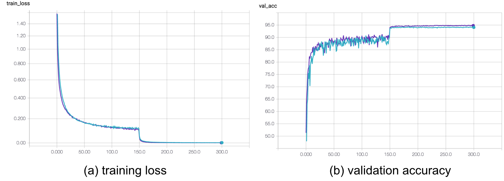

# A PyTorch Implementation for Densely Connected Convolutional Networks (DenseNets)

This repository contains a [PyTorch](http://pytorch.org/) implementation of the paper [Densely Connected Convolutional Networks](http://arxiv.org/abs/1608.06993). The code is based on the excellent [PyTorch example for training ResNet on Imagenet](https://github.com/pytorch/examples/tree/master/imagenet).

The detault setting for this repo is a DenseNet-BC (with bottleneck layers and channel reduction), 100 layers, a growth rate of 12 and batch size 128. 

The [Official torch implementaion](https://github.com/liuzhuang13/DenseNet) contains further links to implementations in other frameworks.

Example usage with optional arguments for different hyperparameters (e.g., DenseNet-40-12):
```sh
$ python train.py --layers 40 --growth 12 --no-bottleneck --reduce 1.0 --name DenseNet-40-12
```

## DenseNets
[DenseNets [1]](https://arxiv.org/abs/1608.06993) were introduced in late 2016 after to the discoveries by [[2]](https://arxiv.org/abs/1603.09382) and [[3]](https://arxiv.org/abs/1605.06431) that [residual networks [4]](https://arxiv.org/abs/1512.03385) exhibit extreme parameter redundancy. DenseNets address this shortcoming by reducing the size of the modules and by introducing more connections between layers. In fact, the output of each layer flows directly as input to all subsequent layers of the same feature dimension as illustrated in their Figure 1 (below). This increases the dependency between the layers and thus reduces redundancy.


The improvements in accuracy per parameter are illustrated in their results on ImageNet (Figure 3). 


## This implementation
The training code in train.py trains a DenseNet on CIFAR 10 or 100. To train on ImageNet, densenet.py can be copied into the [PyTorch example for training ResNets on Imagenet](https://github.com/pytorch/examples/tree/master/imagenet), upon which this repo is based. Note that for ImageNet the model contains four dense blocks.

This implementation allows for __all model variants__ in the DenseNet paper, i.e., with and without bottleneck, channel reduction, data augmentation and dropout. 

For simple configuration of the model, this repo uses `argparse` so that key hyperparameters can be easily changed.

Further, this implementation supports [easy checkpointing](https://github.com/andreasveit/densenet-pytorch/blob/master/train.py#L136), keeping track of the best model and [resuming](https://github.com/andreasveit/densenet-pytorch/blob/master/train.py#L103) training from previous checkpoints.

### Tracking training progress with TensorBoard
To track training progress, this implementation uses [TensorBoard](https://www.tensorflow.org/get_started/summaries_and_tensorboard) which offers great ways to track and compare multiple experiments. To track PyTorch experiments in TensorBoard we use [tensorboard_logger](https://github.com/TeamHG-Memex/tensorboard_logger) which can be installed with 
```
pip install tensorboard_logger
```
Example training curves for DenseNet-BC-100-12 (dark blue) and DenseNet-40-12 (light blue) for training loss and validation accuracy is shown below. 



### Hot Fix for PyTorch issue of grad_output of cuDNN convolution
The current `pip` version (0.1.8) of PyTorch has an issue with the grad_output of cuDNN convolutions followed by a `torch.cat`. A [fix](https://github.com/pytorch/pytorch/pull/708) has been merged with the PyTorch master branch on Feb 9th 2017. 

This implementation includes a [hot fix](https://github.com/andreasveit/densenet-pytorch/blob/master/densenet.py#L16) to be compatible with the current PyTorch version. The hot fix includes a dummy operation (dropout with droprate 1e-7) between `conv` and `cat` laeyers. The fix will be removed once the above mentioned pull request becomes part of the next release.

### Cite
If you use DenseNets in your work, please cite the original paper as:
```
@article{Huang2016Densely,
  author  = {Huang, Gao and Liu, Zhuang and Weinberger, Kilian Q.},
  title   = {Densely Connected Convolutional Networks},
  journal = {arXiv preprint arXiv:1608.06993},
  year    = {2016}
}
```

If this implementation is useful to you and your project, please also consider to cite or acknowledge this code repository.

### References 
[1] Huang, G., Liu, Z., Weinberger, K. Q., & van der Maaten, L. (2016). Densely connected convolutional networks. arXiv preprint arXiv:1608.06993.

[2] Huang, G., Sun, Y., Liu, Z., Sedra, D., & Weinberger, K. Q. (2016). Deep networks with stochastic depth. In European Conference on Computer Vision (ECCV '16)

[3] Veit, A., Wilber, M. J., & Belongie, S. (2016). Residual networks behave like ensembles of relatively shallow networks. In Advances in Neural Information Processing Systems (NIPS '16)

[4] He, K., Zhang, X., Ren, S., & Sun, J. (2016). Deep residual learning for image recognition. In Conference on Computer Vision and Pattern Recognition (CVPR '16)
